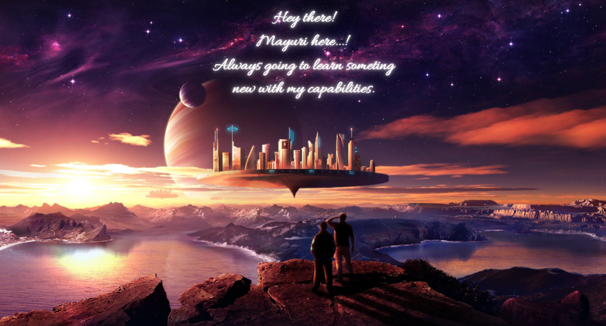

<h1 align="center">Hi 👋, I'm Mayuri R. Pujari #MRP</h1>
<h3 align="center">🌸 Aesthetic Frontend Developer | Lifelong Learner | Coding Enthusiast 🌸</h3>

  

---

  🔭 I’m currently working on <b>Web Development projects</b>  
  🌱 Learning: <b>Machine Learning (Python), DSA, Web Dev Frameworks, Python Libraries</b>  
  💬 Ask me about <b>Presentation Skills</b>  
  📫 Reach me: <b>b23es1026@iitj.ac.in</b>  
  📄 Know about my experiences: <b>Volunteering & Presentations in Projects</b>  
  ⚡ Fun fact: <i>I think I am aesthetic but I am not... :p</i>

---

## 🚀 My Projects

- Explore all my work: [GitHub Portfolio](https://github.com/Mayu-infinite)

---

## 🌐 Connect with Me

  
  
  
  

---

## 🛠️ Languages & Tools

  
  
  
  
  
  
  

---

## 📊 GitHub Stats

  
  

---

## ✨ About Me

- 🎓 Student at IIT Jodhpur | Chhatrapati Sambhajinagar, Maharashtra
- 👩‍💻 Passionate about building beautiful, user-friendly web interfaces
- 🧩 Always eager to learn new technologies, frameworks, and algorithms
- 🎤 Love public speaking, volunteering, and sharing knowledge

---

  <b>Let’s connect, collaborate, and code something amazing together! 🚀</b>

