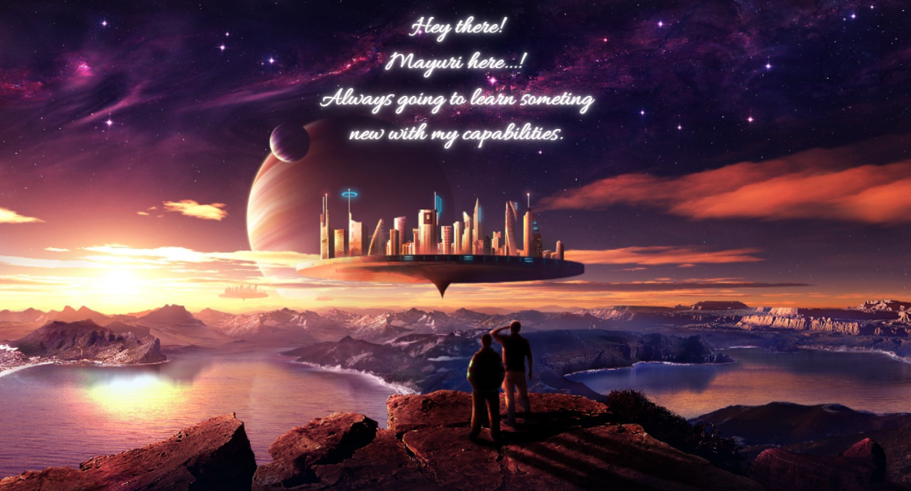

  

<h1 align="center">
  Hi there, I'm Mayuri Pujari! 
</h1>

  <em>Aspiring Software Developer | It's not who I am underneath, but what I do that defines me. 
  Passionate about exploring new technologies and building impactful solutions. 
  Currently diving deeper into C++, JavaScript, and React.</em>

  

---

## 🛠️ My Tech Stack & Tools

Here are some of the technologies and tools I'm working with or have experience in:

**Languages:**  

**Frameworks & Libraries:**  

**Databases:**  

**Tools & Platforms:**  

**Data Science & ML:**  

---

## 📊 GitHub Stats & Activity

  

## 📫 Get In Touch

  
  &nbsp;&nbsp;
  

---

>"I don't want to survive. I want to live."  
> <em>— The Captain, WALL-E</em>

---

  <em>Thanks for visiting my profile! Have a great day! 😊</em>

